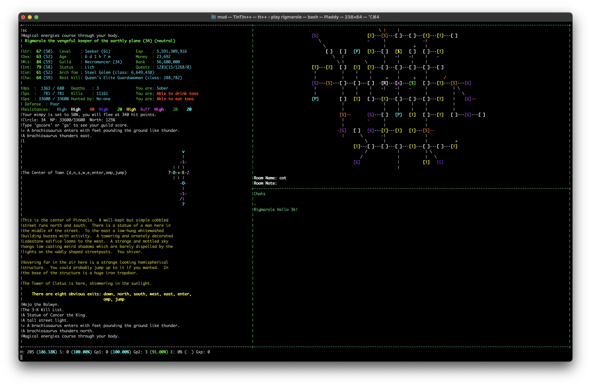

# MUDing is FUN!

These are my tintin++ files and profiles for 3 Kingdoms: http://3k.org/



## Install Repository

Clone the repo: `git clone git@github.com:pladdy/mud.git`

- this has been tested to run on a Mac; I've made some efforts to make it nix' compatible but it might need more love
- windows users can install cygwin and then install this in your cygwin environment
- There's also a Dockerfile that enables you to run via docker.

### Running with Docker

You can run the client using [Docker](https://www.docker.com/get-started/).

With docker installed:

To get started create your profile with `make player player=<player name> guild=<your guild>`

Then, run `make play player=<your player name>`

### Running on macOS

`make install`

- This might work on ubuntu/fedora which use apt-get and yum...not tested

Once the repo is installed and `./play` can run, set up a profile to play.

## Setup a profile to play

To set up a profile run `bin/create_profile <char name> <guild name>`

Example: `bin/create_profile gilead necros`

The `profiles/` directory houses profiles.  These are the files that handle setting
up the session when logging in with a specific character.

## Usage

`./play <character name>`

- The play script will automatically search the *profiles/* directory for the given character file.
- The map that loads is displayed on the right of the client screen.  Currently the client screen
  is set to a hard coded width of 101.  Any remaining screen width will be used for the map.
  - I use this client with a terminal screen of 230 width, I haven't tested it with resizing or
    smaller widths.

## Docs

If you want to learn more about what commands are available while playing, see [Docs](docs/Aliases.md)

## Details

### Dependency Notes

- Docker OR
- Mac/Unix based OS
  - Cygwin seems to work as an OS platform if you're using windows (tested by Wag)

#### Additional dependencies

- Perl
  - This should already be installed by default on non-windows OS' (and in Cygwin)
- TinTin++ Mud Client: http://tintin.sourceforge.net/

## Development

### Tagging

Using [Semver](https://semver.org/) for versionig (or trying!).  Tags can be added via the command line:

Options for `make tag <version>` are
- major
- minor
- patch

```
# Patch
make tag type=patch # will create a patch: 0.5.0 -> 0.5.1 for example
make release
```
